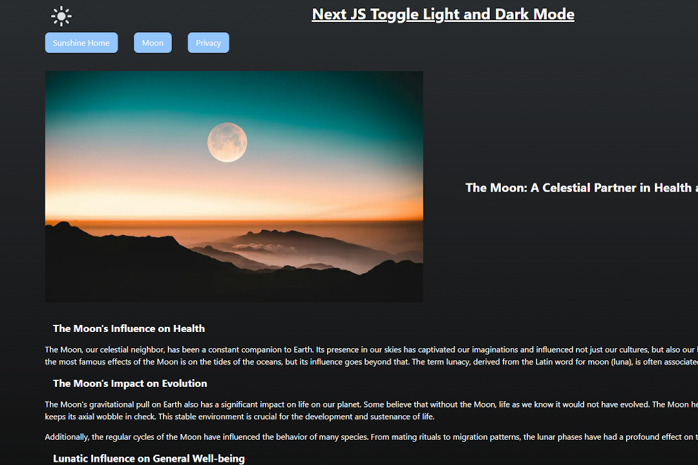

# Next JS Theme Toggle Boilerplate for Light and Dark Mode

Toggle between light and dark mode, persist the state via encrypted session token and display a cookie consent and privacy policy via Next JS' intercepting and parallel routes.



Kudos to the instructive article [best light/dark mode theme toggle in JavaScript](https://dev.to/whitep4nth3r/the-best-lightdark-mode-theme-toggle-in-javascript-368f) by Salma Alam-Naylor.

## Using session cookies for persistence

This toggle light and dark mode boilerplate takes a slightly different approach and saves the state of the theme mode in an encrypted session token. With Next JS and SSR, it is a bit tricky to read the setting from the localStorage on the client side without flickering. Next 14, on the other hand, makes cookie management very simple and session variables are actually also intended to make the state persistent. The session token is delivered free of charge via middleware and can pass on the currently selected mode to layout.ts.

## GDPR Cookie Consent and Privacy

As the setting of cookies is GDPR-relevant in many countries, a basic cookie consent banner is supplied as well as a privacy policy that uses intercepting and parallel routes from Next JS 14.

This is a [Next.js](https://nextjs.org/) project bootstrapped with [`create-next-app`](https://github.com/vercel/next.js/tree/canary/packages/create-next-app).

## Getting Started

### Add Secret Key to your environmental variables

To work properly you need to add a SECRET_KEY to your environmental variables in the root directory of your local storage `.env.local`.

```bash
SECRET_KEY=xxxxxxxxxxxxxxxxxxxxxxxxxxxxx
```

### Customize Settings

You can adjust your settings (expiring dates of the session token and cookie consent in seconds) to your requirements at `./lib/constants.ts`

```typescript
export const SESSION_EXPIRING_SECONDS = 10 * 60;
export const COOKIE_CONSENT_EXPIRING_SECONDS = 60 * 60;
export const FALLBACK_THEME: Theme = 'dark';
```

### Start Development Server

Run the development server:

```bash
npm run dev
# or
yarn dev
# or
pnpm dev
# or
bun dev
```

Open [http://localhost:3000](http://localhost:3000) with your browser to see the result.

You can start editing the page by modifying `app/page.tsx`. The page auto-updates as you edit the file.

## Learn More

To learn more about Next.js, take a look at the following resources:

- [Next.js Documentation](https://nextjs.org/docs) - learn about Next.js features and API.
- [Learn Next.js](https://nextjs.org/learn) - an interactive Next.js tutorial.

You can check out [the Next.js GitHub repository](https://github.com/vercel/next.js/) - your feedback and contributions are welcome!

## Deploy on Vercel

The easiest way to deploy your Next.js app is to use the [Vercel Platform](https://vercel.com/new?utm_medium=default-template&filter=next.js&utm_source=create-next-app&utm_campaign=create-next-app-readme) from the creators of Next.js.

Check out our [Next.js deployment documentation](https://nextjs.org/docs/deployment) for more details.
